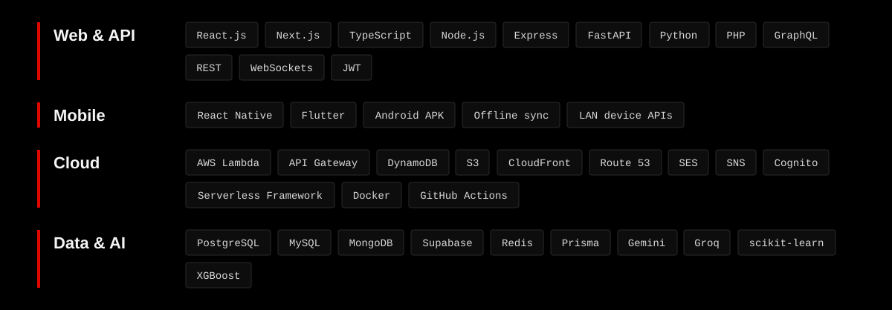

 

**Full stack engineer. I take a product from design to deployment, then keep it fast when real people use it.**

## Shipped

## What I build with

## Selected work

| Product | What it does | What was hard |
|---|---|---|
| **Pabitra Electricals system** | Runs day-to-day operations for 20–30 people | Requirements changed mid-build, so the database was restructured several times. API schema trimmed so responses carry only what the frontend needs |
| **Tekkzy Fit** | Gym desk app (React Native) linked to a face-attendance terminal over the local network, plus staff web desk and cloud APIs | Phone finds the terminal on gym Wi-Fi by itself, queues punches offline, and syncs when staff reconnect |
| **Crusher Management System** | Material production, expenses, sales and machine tracking | Delivered in 5 days and tuned to respond at 0.1 Mbps |
| **Electricity billing software** | Billing for a live client | About 600 bills generated each month |
| **TekkzyWork** | HR management tool | In progress |

 

Web → Mobile → Cloud.

